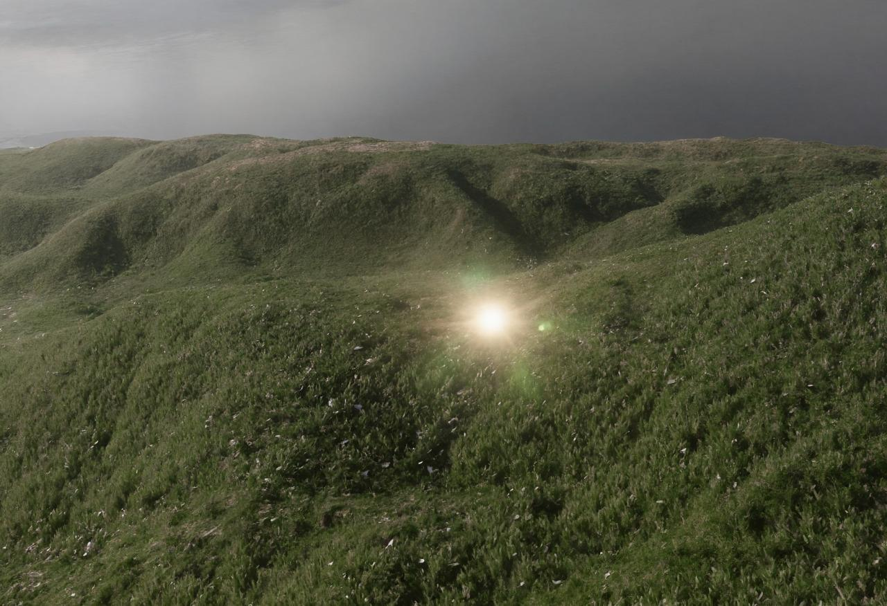

This theme does not define more levels of headlines. If needed, you can define them in `src/styles/post.css`

---

## Paragraph

Here's a practical example of a paragraph in Markdown. This text demonstrates how content flows naturally in a blog post.

You can use various formatting options like **bold**, *italic*, ~~strikethrough~~, and `code` within your paragraphs.

## Blockquotes

> Don't communicate by sharing memory, share memory by communicating.&lt;br&gt; — &lt;cite&gt;Rob Pike\[^1\]&lt;/cite&gt;

\[^1\]: The above quote is excerpted from Rob Pike's [talk](https://www.youtube.com/watch?v=PAAkCSZUG1c) during Gopherfest, November 18, 2015.

### Ordered List

1. First item
2. Second item
3. Third item

### Unordered List

- Item
  - Subitem
  - Subitem

## Task List

- \[ \] First item
- \[ \] Second item
- \[x\] Third item

## Image

To hide the caption, start it with an underscore `_` or leave the alt text empty.



## Tables

| Style | Weight | Other |
| --- | --- | --- |
| Normal | Regular | Text |
| *Italic* | **Bold** | `Code` |

## Code Blocks

```jsx
// Button.jsx

const Button = ({ text, onClick }) => {
  const [count, setCount] = useState(0)

  const handleClick = () => {
    setCount(count + 1)
    onClick?.()
  }

  return (
    <button className="btn" onClick={handleClick}>
      {text} ({count})
    </button>
  )
}
```

## Other Elements — sub, sup, abbr, kbd, mark

H&lt;sub&gt;2&lt;/sub&gt;O

X&lt;sup&gt;n&lt;/sup&gt; + Y&lt;sup&gt;n&lt;/sup&gt; = Z&lt;sup&gt;n&lt;/sup&gt;

<abbr title="Graphics Interchange Format">GIF</abbr> is a bitmap image format.

Press &lt;kbd&gt;CTRL&lt;/kbd&gt; + &lt;kbd&gt;ALT&lt;/kbd&gt; + &lt;kbd&gt;Delete&lt;/kbd&gt; to end the session.

Most &lt;mark&gt;salamanders&lt;/mark&gt; are nocturnal, and hunt for insects, worms, and other small creatures.

---